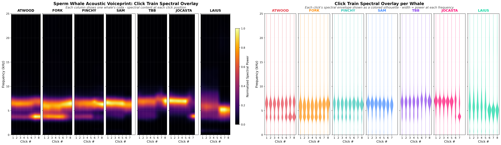

# Where's WHaldo?

**Individual sperm whale identification from acoustic signatures alone.**

Each sperm whale's head is a unique acoustic instrument. The spermaceti organ - a massive reverberant cavity between two air sac mirrors - shapes every click with a distinct spectral fingerprint determined by skull geometry, organ length, and tissue properties. This project extracts that fingerprint and uses it to identify individual whales from recordings.


*Left: Inferno heatmap showing spectral power at each click position per whale. Right: Colored spectral silhouettes showing the resonance shape of each click. Every whale is visually distinct.*

## Results

Validated across three independent datasets from the Dominica Sperm Whale Project population:

| Dataset | Whales | Features | Best Accuracy | vs. Chance |
|---------|--------|----------|---------------|------------|
| DSWP audio | 3 | 30 (spectral + temporal) | **91.5%** (Gradient Boosting) | 2.8x |
| Gero et al. ICI timing | 16 | 37 (inter-click intervals) | **57.7%** (Random Forest) | 9.2x |
| CETI spectral | 13 | 14 (frequency band energy) | **85.9%** (Random Forest) | 11.2x |
| CETI 3-whale subset | 3 | 14 (frequency band energy) | **90.5%** (Random Forest) | 2.7x |

**Key finding:** Spectral resonance (the "voice" - shaped by anatomy) is ~25 percentage points stronger than rhythm (the "accent" - click timing) for individual ID. Combined, they form a complete acoustic fingerprint.

### Top Discriminating Features

**Spectral (from cavity resonance):**
- Frequency band energy: 500Hz-2kHz (0.121), 100-500Hz (0.110)
- Spectral slope, flatness, peak frequency

**Temporal (from click timing):**
- ICI ratio between clicks 1 and 2 (0.057)
- Coda length, normalized rhythm pattern

## How It Works

### The Physics

Sperm whale clicks are produced by the spermaceti organ:

1. Sound generated at the phonic lips
2. Bounces between frontal air sac (backed by concave skull) and distal air sac
3. Each round trip produces one pulse (P0, P1, P2...)
4. Inter-Pulse Interval = 2 x organ length / sound speed in spermaceti
5. The skull geometry, tissue density gradients, and cavity resonance shape the spectral envelope

Each whale's unique skull curvature, organ length, and tissue properties create a distinct resonance signature - essentially a voiceprint from anatomy.

### The Simulator

A 2D FDTD acoustic simulation of the sperm whale head:
- Sagittal plane cross-section with realistic tissue properties
- Spermaceti organ, junk (GRIN lens), skull bone, air sac reflectors
- Gaussian-smoothed tissue boundaries (biologically accurate, numerically stable)
- 720K grid points, runs in 20-30 seconds per whale
- Reproduces multi-pulse click structure (P0/P1/P2)

### The Classifier

30-feature voiceprint extracted from each coda:
- Spectral: centroid, bandwidth, rolloff, 6 frequency band energies, slope
- Temporal: ICI statistics, rhythm pattern, coda length
- Click shape: zero crossing rate, rise/fall times

Gradient Boosting, Random Forest, and SVM classifiers tested across datasets.

## Project Structure

```
simulation/
  sperm_whale_sim.py          # 2D FDTD acoustic simulation of sperm whale head
  whale_hires_analysis.py     # High-res frequency-time analysis of simulated clicks
  whale_ocean_propagation.py  # Ocean temperature effects on voiceprint propagation
  whale_depth_propagation.py  # Depth-dependent ray tracing, SOFAR channel analysis

analysis/
  whale_signal_analysis.py    # Process raw WAV files (amplitude, FFT, spectrograms)
  whale_deep_analysis.py      # Full signal sweep grouped by coda type
  whale_voiceprint.py         # Per-whale acoustic profiles + ML identification
  analyze_gero.py             # Gero et al. identity cues dataset analysis
  analyze_ceti.py             # CETI vowels/spectral dataset analysis
  combined_voiceprint_analysis.py  # Cross-dataset combined voiceprint
  generate_panel_a.py         # Spectral envelope figure
  generate_panel_d.py         # Inferno click train overlay figure
  generate_colored_d.py       # Colored spectral silhouette figure

figures/
  voiceprint_final.png        # Combined dual-view voiceprint (main figure)
  voiceprint_overlay_D.png    # Inferno heatmap panel
  voiceprint_colored_D.png    # Colored silhouettes panel
  voiceprint_spectral_A.png   # Spectral envelope lines
  combined_voiceprint.png     # Full 4-panel analysis figure

material_properties.md        # Tissue acoustic properties reference
wheres_WHaldo.md              # Full project document with observations and ideas
```

## Datasets Used

1. **DSWP** (Dominica Sperm Whale Project) - 1,500 WAV files, 8,719 labeled codas, 3 identified whales
2. **Gero et al. (2016)** - ICI timing data from 9 social units, 16 identified whales ([Dryad](https://datadryad.org/dataset/doi:10.5061/dryad.ck4h0))
3. **CETI Phonology** - 7,168 clicks with 257-bin spectra, 13 named whales ([OSF](http://doi.org/10.17605/OSF.IO/A32KE))

## Requirements

```
numpy
scipy
matplotlib
pandas
scikit-learn
openpyxl      # for Gero .xlsx data
pyarrow       # for CETI .ft (feather) data
```

## Quick Start

```bash
# Run the acoustic simulator for three whale geometries
python simulation/sperm_whale_sim.py

# Extract voiceprint features and classify individuals
python analysis/whale_voiceprint.py

# Cross-dataset validation
python analysis/analyze_gero.py
python analysis/analyze_ceti.py
python analysis/combined_voiceprint_analysis.py
```

## References

- Norris & Harvey (1972) - Bent horn model
- Cranford (1999, 2000) - Sperm whale acoustic anatomy
- Zimmer et al. (2005) JASA - Quantitative acoustic model
- Madsen et al. (2002) - IPI measurements, body length correlation
- Mohl et al. (2003) JASA - 236dB source level, beam pattern
- Gero, Whitehead & Rendell (2016) - Individual identity cues in codas
- Sharma et al. (2024) Nature Comms - Combinatorial structure in sperm whale vocalizations

## License

MIT

## Citation

If you use this work, please cite:

```
Browy, E. (2026). Where's WHaldo? Individual sperm whale identification
from spectral voiceprints. GitHub: mepsopti/Wheres-Whaldo-
```
